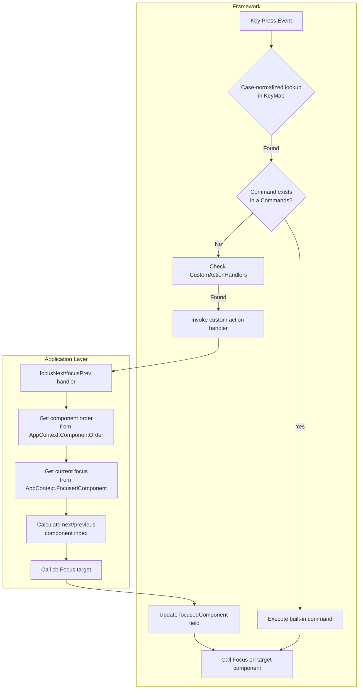

# Fix Tab/Shift+Tab Navigation for focusNext/focusPrev

## Problem Analysis

Two issues prevent the tab and shift+tab shortcuts from working:

### Issue 1: Case Sensitivity Mismatch
In [`app/app.go:161`](app/app.go:161), the key lookup uses `kmsg.String()` which returns `"Tab"` (capital T) and `"Shift+Tab"`, but the YAML keybindings use lowercase `"tab"` and `"shift+tab"`. This case mismatch prevents the key lookup from finding the commands.

### Issue 2: Missing Custom Action Handler Support
The `focusNext` and `focusPrev` commands referenced in the YAML are not defined as built-in commands. They are intended to be custom action handlers registered by the consuming application (in `main.go`). However, the key handler in `app.go` only checks `a.Commands` and does not fall back to `command.CustomActionHandlers`.

## Solution Plan

### Step 1: Fix Case Sensitivity in app/app.go

**File:** [`app/app.go`](app/app.go:161)

Change the key lookup to normalize the key string to lowercase:

```go
// Before:
cmdName, exists := a.KeyMap[kmsg.String()]

// After:
cmdName, exists := a.KeyMap[strings.ToLower(kmsg.String())]
```

Also add `"strings"` to the imports.

### Step 2: Add Custom Action Handler Support in app/app.go

**File:** [`app/app.go`](app/app.go:160-169)

After checking `a.Commands`, also check `command.CustomActionHandlers` for the command name:

```go
// Handle key presses.
if kmsg, ok := msg.(tea.KeyPressMsg); ok {
    cmdName, exists := a.KeyMap[strings.ToLower(kmsg.String())]
    if exists {
        if cmd, ok := a.Commands[cmdName]; ok {
            ctx := &appContext{app: a}
            cb := &commandCallback{app: a, cmds: &allCmds}
            cmd.Execute(ctx, cb)
        } else if handler, ok := command.CustomActionHandlers[cmdName]; ok {
            ctx := &appContext{app: a}
            cb := &commandCallback{app: a, cmds: &allCmds}
            cmds := handler(ctx, cb)
            allCmds = append(allCmds, cmds...)
        }
    }
}
```

### Step 3: Extend AppContext Interface

**File:** [`command/command.go`](command/command.go:14-19)

Add two new methods to the `AppContext` interface:

```go
type AppContext interface {
    GetComponent(name string) (component.Component, bool)
    ComponentNames() []string
    ComponentOrder() []string   // NEW: returns components in layout order
    FocusedComponent() string   // NEW: returns currently focused component name
}
```

### Step 4: Track Current Focus and Implement New Methods

**File:** [`app/app.go`](app/app.go)

Add `focusedComponent` field to the `App` struct:

```go
type App struct {
    Components map[string]component.Component
    Commands   map[string]command.Command
    KeyMap     map[string]string
    Layout     loader.LayoutConfig

    // Runtime state
    TermWidth        int
    TermHeight       int
    focusedComponent string  // NEW: track currently focused component
}
```

Implement the new `AppContext` methods for `appContext`:

```go
func (c *appContext) ComponentOrder() []string {
    var order []string
    for _, row := range c.app.Layout.Rows {
        order = append(order, row.Components...)
    }
    return order
}

func (c *appContext) FocusedComponent() string {
    return c.app.focusedComponent
}
```

Update `Init()` to set the initial focused component:

```go
func (a *App) Init() tea.Cmd {
    for name, comp := range a.Components {  // Also capture name
        if focuser, ok := comp.(interface{ Focus() tea.Cmd }); ok {
            a.focusedComponent = name
            return focuser.Focus()
        }
        if focuser, ok := comp.(interface{ Focus() }); ok {
            a.focusedComponent = name
            focuser.Focus()
        }
        break
    }
    return nil
}
```

Update `commandCallback.Focus()` to track focus changes:

```go
func (cb *commandCallback) Focus(name string) {
    comp, ok := cb.app.Components[name]
    if !ok {
        return
    }
    cb.app.focusedComponent = name  // NEW: track focus
    if focuser, ok := comp.(interface{ Focus() }); ok {
        focuser.Focus()
    }
}
```

### Step 5: Register focusNext and focusPrev Handlers in main.go

**File:** [`cmd/examples/main.go`](cmd/examples/main.go)

Add imports:

```go
import (
    // ... existing imports ...
    tea "charm.land/bubbletea/v2"
    "github.com/SevcikMichal/yamtui/command"
)
```

Register the handlers in `main()`, after `component.Init()`:

```go
// Initialize the component registry with built-in types.
component.Init()

// Register custom action handlers for focus navigation.
command.RegisterCustomAction("focusNext", func(ctx command.AppContext, cb command.CommandCallback) []tea.Cmd {
    order := ctx.ComponentOrder()
    if len(order) == 0 {
        return nil
    }
    current := ctx.FocusedComponent()
    for i, name := range order {
        if name == current {
            next := order[(i+1)%len(order)]
            cb.Focus(next)
            return nil
        }
    }
    // Current focus not found in order, focus first component
    cb.Focus(order[0])
    return nil
})

command.RegisterCustomAction("focusPrev", func(ctx command.AppContext, cb command.CommandCallback) []tea.Cmd {
    order := ctx.ComponentOrder()
    if len(order) == 0 {
        return nil
    }
    current := ctx.FocusedComponent()
    for i, name := range order {
        if name == current {
            prev := order[(i-1+len(order))%len(order)]
            cb.Focus(prev)
            return nil
        }
    }
    // Current focus not found in order, focus last component
    if len(order) > 0 {
        cb.Focus(order[len(order)-1])
    }
    return nil
})
```

## Architecture Diagram



## Files Modified

| File | Changes |
|------|---------|
| [`app/app.go`](app/app.go) | Case sensitivity fix, custom action support, focus tracking |
| [`command/command.go`](command/command.go) | Extended AppContext interface |
| [`cmd/examples/main.go`](cmd/examples/main.go) | Registered focusNext/focusPrev handlers |
