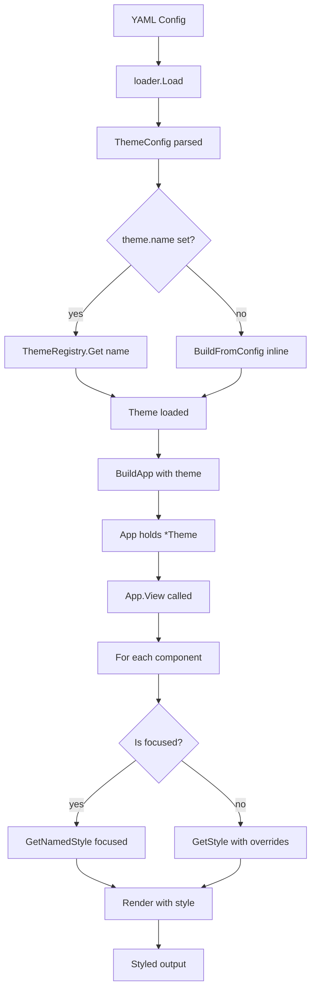
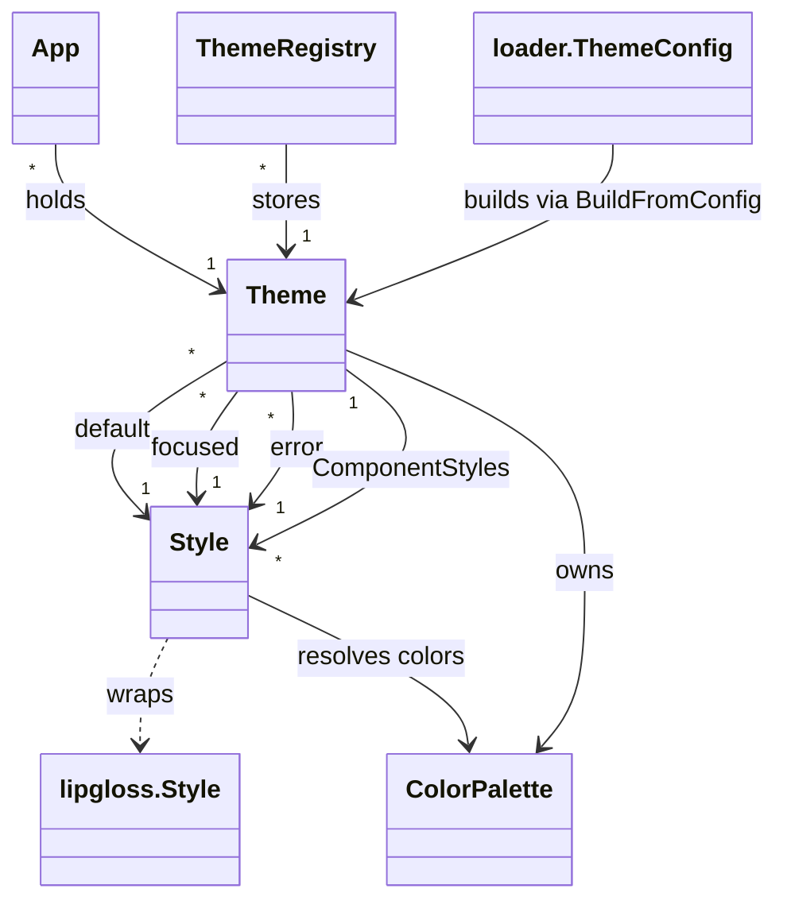

# Declarative Theme System Design

## 1. Overview

This document describes the design for a declarative theme system using `lipgloss/v2` that integrates seamlessly with the existing YAML-driven UI architecture of yamtui. Themes are defined declaratively in YAML, applied globally to all components, and use reflection to set style properties — mirroring the existing component property system.

### Goals

- Define themes declaratively in YAML, just like UI components
- Use `lipgloss/v2` for all styling
- Apply styles globally via reflection (reuse the `PropertySetter` pattern)
- Support built-in default themes (catppuccin, dracula, nord, etc.)
- Support theme inheritance (simple base → override pattern)
- Keep it simple, SOLID, and YAGNI

### Non-Goals (Out of Scope for v1)

- Per-component style inheritance chains (only direct base override)
- Runtime theme switching via keybinding (static at load time)
- Animated theme transitions
- CSS-like cascade or specificity rules

---

## 2. Architecture Overview

```
┌─────────────────────────────────────────────────────────────┐
│                     YAML Configuration                       │
│  theme: { name, colors, default, focused, components: {} }   │
└──────────────────────┬──────────────────────────────────────┘
                       │
                       ▼
┌─────────────────────────────────────────────────────────────┐
│                   internal/loader/                           │
│  ThemeConfig — parses theme section from YAML               │
└──────────────────────┬──────────────────────────────────────┘
                       │
                       ▼
┌─────────────────────────────────────────────────────────────┐
│                    theme/ package                            │
│  ┌───────────┐  ┌────────────┐  ┌──────────────────┐        │
│  │  Theme    │  │   Style    │  │ ThemeRegistry    │        │
│  │ (named    │  │ (wraps     │  │ (stores & looks  │        │
│  │  styles)  │  │  lipgloss  │  │  up themes)      │        │
│  │           │  │  style)    │  │                  │        │
│  └───────────┘  └────────────┘  └──────────────────┘        │
│                                                              │
│  ┌──────────────────────────────────────────────────────┐   │
│  │  ColorPalette — named colors (hex, ANSI, tea)        │   │
│  └──────────────────────────────────────────────────────┘   │
└──────────────────────┬──────────────────────────────────────┘
                       │
                       ▼
┌─────────────────────────────────────────────────────────────┐
│                      app/ package                            │
│  App holds *theme.Theme, applies it during View()           │
└──────────────────────┬──────────────────────────────────────┘
                       │
                       ▼
┌─────────────────────────────────────────────────────────────┐
│                 component/ package                           │
│  Components render with theme styles applied via wrapper     │
└─────────────────────────────────────────────────────────────┘
```

---

## 3. YAML Schema

### 3.1 Root Configuration (Updated)

The existing `theme` section in the YAML configuration is extended:

```yaml
# Existing fields remain unchanged
alt_screen: true

theme:
  name: "catppuccin"           # Reference a built-in theme
  # OR define inline:
  colors:                       # Named color palette
    text: "#D1D0E6"
    background: "#24273A"
    muted: "#787C9C"
    cursor: "#F4DBDB6"
    accent: "#B7BDF8"
    error: "#FF897F"
    success: "#ABE9B3"
    warning: "#FAF8A5"

  default:                      # Base style for all components
    padding: [1, 2, 1, 2]
    margin: [0, 0, 0, 0]
    bold: false

  focused:                      # Style for focused component
    border: rounded
    border_color: accent
    color: text

  error:                        # Style for error state
    color: error
    bold: true

  components:                   # Per-component overrides
    notesArea:
      border: rounded
      border_color: muted
    quickInput:
      color: accent
      padding: [0, 1, 0, 1]

components:
  notesArea:
    type: "textarea"
    properties:
      placeholder: "Write your notes here..."

  quickInput:
    type: "input"
    properties:
      placeholder: "Quick command..."
```

### 3.2 Schema Reference

#### `theme.colors` — Color Palette

Each color can be defined as:
- **Hex string**: `"#FF5733"`, `"#FF573380"` (with alpha)
- **Named ANSI**: `"red"`, `"green"`, `"blue"`, `"yellow"`, `"magenta"`, `"cyan"`, `"white"`, `"black"`
- **Tea/lipgloss colors**: `"teal"`, `"pink"`, `"purple"`, `"orange"`, `"yellow"`

#### `theme.default` — Base Style

Applied to every component by default. All properties are optional.

| Property | Type | lipgloss Method | Description |
|----------|------|-----------------|-------------|
| `color` / `foreground` | string | `Foreground(color)` | Text foreground color |
| `background` | string | `Background(color)` | Background color |
| `bold` | bool | `Bold(bool)` | Bold text |
| `italic` | bool | `Italic(bool)` | Italic text |
| `underline` | bool | `Underline(bool)` | Underlined text |
| `strikethrough` | bool | `Strikethrough(bool)` | Strikethrough text |
| `reverse` | bool | `Reverse(bool)` | Reverse colors |
| `blink` | bool | `Blink(bool)` | Blinking text |
| `dim` / `faint` | bool | `Dim(bool)` | Dim/faint text |
| `padding` | [int,int,int,int] | `Padding(t,r,b,l)` | Padding (top, right, bottom, left) |
| `margin` | [int,int,int,int] | `Margin(t,r,b,l)` | Margin (top, right, bottom, left) |
| `border` | string | `BorderStyle(type)` | Border style: `none`, `rounded`, `bold`, `hidden`, `thick`, `double`, `outer`, `inner`, `outer` |
| `border_color` | string | `BorderForeground(color)` | Border foreground color |
| `border_background` | string | `BorderBackground(color)` | Border background color |
| `width` | int | `Width(int)` | Fixed width |
| `height` | int | `Height(int)` | Fixed height |
| `align` | string | `Align(h,v)` | Text alignment: `left`, `center`, `right`, `top`, `bottom` |
| `invisible` | bool | `Invisible(bool)` | Invisible but takes space |
| `tab_width` | int | `TabWidth(int)` | Number of spaces per tab |

#### `theme.focused`, `theme.error`, etc. — Named States

Additional named styles that can be referenced by components or commands.

#### `theme.components` — Per-Component Overrides

Map of component name → style overrides. These merge on top of `default`.

---

## 4. Package Structure

```
theme/
  theme.go       # Theme, ThemeRegistry types
  style.go       # Style wrapper with reflection-based property application
  color.go       # ColorPalette, color parsing and resolution
  borders.go     # Border style helpers and string → lipgloss.BorderStyle mapping
  defaults.go    # Built-in theme definitions
```

---

## 5. Type Definitions

### 5.1 `theme.Style`

```go
// Style wraps lipgloss.Style and provides reflection-based property setting.
type Style struct {
    s lipgloss.Style
}

// NewStyle creates a new empty Style.
func NewStyle() Style

// Render returns the styled string.
func (s Style) Render(strs ...string) string

// SetProperty sets a style property by name using reflection.
// Supported properties: color, background, bold, italic, underline,
// strikethrough, reverse, blink, dim, padding, margin, border,
// border_color, border_background, width, height, align, invisible, tab_width
func (s Style) SetProperty(name string, value any) error

// Merge combines another Style into this one (later values win).
func (s Style) Merge(other Style) Style

// Copy returns a deep copy of the Style.
func (s Style) Copy() Style
```

### 5.2 `theme.Theme`

```go
// Theme holds a collection of named styles.
type Theme struct {
    Name         string
    Colors       ColorPalette
    Default      Style
    Focused      Style
    Error        Style
    // Extensible: additional named styles stored here
    Styles       map[string]Style
    // Per-component overrides: component name → style overrides
    ComponentStyles map[string]Style
}

// GetStyle returns the style for a component name.
// It merges Default with any component-specific overrides.
func (t *Theme) GetStyle(componentName string) Style

// GetNamedStyle returns a named style (e.g., "focused", "error").
// Returns the Default style if the named style doesn't exist.
func (t *Theme) GetNamedStyle(name string) Style
```

### 5.3 `theme.ThemeRegistry`

```go
// ThemeRegistry stores and looks up themes by name.
type ThemeRegistry struct {
    themes map[string]*Theme
    mu     sync.RWMutex
}

// NewThemeRegistry creates a new registry with built-in themes loaded.
func NewThemeRegistry() *ThemeRegistry

// Register adds a theme to the registry.
func (r *ThemeRegistry) Register(t *Theme)

// RegisterFromYAML parses a YAML theme definition and registers it.
func (r *ThemeRegistry) RegisterFromYAML(name string, data []byte) error

// Get retrieves a theme by name. Returns nil if not found.
func (r *ThemeRegistry) Get(name string) *Theme
```

### 5.4 `theme.ColorPalette`

```go
// ColorPalette holds named color values.
type ColorPalette struct {
    colors map[string]lipgloss.Color
}

// Get resolves a color name to lipgloss.Color.
// If the name is a hex string, it parses it.
// If the name is a known color name, it returns the mapped value.
func (p *ColorPalette) Get(name string) lipgloss.Color

// Set adds a color to the palette.
func (p *ColorPalette) Set(name string, value string) error
```

---

## 6. Reflection-Based Property Application

The `Style.SetProperty` method uses a lookup table mapping YAML property names to lipgloss method calls:

```go
var propertyHandlers = map[string]func(s lipgloss.Style, v any) error{
    "color":           handleColor,
    "foreground":      handleColor,
    "background":      handleBackground,
    "bold":            handleBool("Bold"),
    "italic":          handleBool("Italic"),
    "underline":       handleBool("Underline"),
    "strikethrough":   handleBool("Strikethrough"),
    "reverse":         handleBool("Reverse"),
    "blink":           handleBool("Blink"),
    "dim":             handleBool("Dim"),
    "faint":           handleBool("Faint"),
    "padding":         handlePadding,
    "margin":          handleMargin,
    "border":          handleBorder,
    "border_color":    handleBorderColor,
    "border_background": handleBorderBackground,
    "width":           handleInt("Width"),
    "height":          handleInt("Height"),
    "align":           handleAlign,
    "invisible":       handleBool("Invisible"),
    "tab_width":       handleInt("TabWidth"),
}
```

Each handler converts the YAML value to the appropriate lipgloss method argument and calls it. This follows the same pattern as the existing `component.PropertySetter` but is specialized for lipgloss `Style` methods.

---

## 7. Integration Points

### 7.1 `internal/loader/schema.go` — Extended ThemeConfig

```go
// ThemeConfig specifies theme configuration from YAML.
type ThemeConfig struct {
    Name          string                   `yaml:"name"`
    Colors        map[string]string        `yaml:"colors"`
    Default       map[string]any           `yaml:"default"`
    Focused       map[string]any           `yaml:"focused"`
    Error         map[string]any           `yaml:"error"`
    Styles        map[string]map[string]any `yaml:"styles"`
    Components    map[string]map[string]any `yaml:"components"`
}
```

### 7.2 `app/app.go` — Theme Integration

The `App` struct gains a `Theme` field:

```go
type App struct {
    // ... existing fields ...
    Theme *theme.Theme  // active theme
}
```

In `BuildApp`:

```go
func BuildApp(cfg *loader.Configuration, registry *theme.ThemeRegistry) (*App, error) {
    // ... existing code ...

    // Load theme
    var th *theme.Theme
    if cfg.Theme.Name != "" {
        th = registry.Get(cfg.Theme.Name)
        if th == nil {
            return nil, fmt.Errorf("theme %q not found", cfg.Theme.Name)
        }
    } else {
        // Build theme from inline config
        th = theme.BuildFromConfig(cfg.Theme)
    }

    return &App{
        // ... existing fields ...
        Theme: th,
    }, nil
}
```

In `App.View()`, wrap each component's output with its theme style:

```go
func (a *App) View() tea.View {
    var rows []string

    for _, row := range a.Layout.Rows {
        var cols []string
        for _, name := range row.Components {
            if c, ok := a.Components[name]; ok {
                styledView := a.Theme.GetStyle(name).Copy().Render(c.View())
                cols = append(cols, styledView)
            }
        }
        rows = append(rows, joinCols(cols, row.Spacing))
    }

    layoutStr := joinRows(rows)

    return tea.View{
        Content:   layoutStr,
        AltScreen: a.AltScreen,
    }
}
```

### 7.3 Focused Component Styling

When rendering the focused component, use the `focused` style instead of `default`:

```go
func (a *App) View() tea.View {
    // ...
    for _, name := range row.Components {
        if c, ok := a.Components[name]; ok {
            var st theme.Style
            if name == a.focusedComponent {
                st = a.Theme.GetNamedStyle("focused")
            } else {
                st = a.Theme.GetStyle(name)
            }
            styledView := st.Copy().Render(c.View())
            cols = append(cols, styledView)
        }
    }
    // ...
}
```

---

## 8. Built-in Themes

### 8.1 `default` — Minimal

```go
func defaultTheme() *Theme {
    return &Theme{
        Name: "default",
        Colors: ColorPalette{
            "text":       lipgloss.Color("#FFFFFF"),
            "background": lipgloss.Color("#1A1B26"),
            "muted":      lipgloss.Color("#5C6166"),
        },
        Default: NewStyle().
            SetProperty("color", "text").
            SetProperty("background", "background"),
        Focused: NewStyle().
            SetProperty("border", "rounded").
            SetProperty("border_color", "accent"),
    }
}
```

### 8.2 `catppuccin` — Catppuccin Mocha

```yaml
colors:
  text: "#CDD6F4"
  background: "#1E1E2E"
  surface: "#313244"
  muted: "#6C7086"
  overlay: "#737992"
  subtle: "#9399B2"
  blue: "#89B4FA"
  lavender: "#B4BEFE"
  sapphire: "#74C7EC"
  sky: "#89DCEB"
  teal: "#94E2D5"
  green: "#A6E3A1"
  yellow: "#F9E2AF"
  peach: "#FAB387"
  maroon: "#F38BA8"
  red: "#F38BA8"
  mauve: "#BA5D83"
  pink: "#F5C2E7"
  flamingo: "#F2D5CF"
  rosewater: "#F5E0DC"

default:
  color: text
  background: background

focused:
  border: rounded
  border_color: blue
  color: lavender
```

### 8.3 `dracula` — Dracula

```yaml
colors:
  text: "#F8F8F2"
  background: "#282A36"
  current_line: "#44475A"
  selection: "#44475A"
  comment: "#6272A4"
  cyan: "#8BE9FD"
  green: "#50FA7B"
  orange: "#FFB86C"
  pink: "#FF79C6"
  purple: "#BD93F9"
  red: "#FF5555"
  yellow: "#F1FA8C"

default:
  color: text
  background: background

focused:
  border: rounded
  border_color: purple
```

### 8.4 `nord` — Nord

```yaml
colors:
  text: "#ECEFF4"
  background: "#2E3440"
  comment: "#4C566A"
  cyan: "#88C0D0"
  dark_cyan: "#81A1C1"
  green: "#A3BE8C"
  orange: "#D08770"
  pink: "#B48EAD"
  purple: "#B48EAD"
  red: "#BF616A"
  yellow: "#EBCB8B"

default:
  color: text
  background: background

focused:
  border: rounded
  border_color: cyan
```

---

## 9. Theme Inheritance

Theme inheritance is implemented via a simple `base` field:

```yaml
theme:
  base: "catppuccin"    # Inherit from built-in theme
  colors:
    accent: "#FF0000"   # Override just this color
  default:
    padding: [0, 1, 0, 1]  # Override padding
```

Implementation:

```go
func (r *ThemeRegistry) RegisterFromYAML(name string, data []byte) (*Theme, error) {
    var cfg loader.ThemeConfig
    yaml.Unmarshal(data, &cfg)

    var th *Theme
    if cfg.Base != "" {
        // Load base theme first
        base := r.Get(cfg.Base)
        if base == nil {
            return nil, fmt.Errorf("base theme %q not found", cfg.Base)
        }
        th = base.Copy()  // Deep copy
    } else {
        th = &Theme{Name: name}
    }

    // Apply overrides from cfg on top of base
    // ...
    return th, nil
}
```

---

## 10. File Changes Summary

| File | Change |
|------|--------|
| `theme/theme.go` | **NEW** — `Theme`, `ThemeRegistry` types |
| `theme/style.go` | **NEW** — `Style` wrapper with reflection |
| `theme/color.go` | **NEW** — `ColorPalette`, color parsing |
| `theme/borders.go` | **NEW** — Border style helpers |
| `theme/defaults.go` | **NEW** — Built-in theme definitions |
| `internal/loader/schema.go` | Extend `ThemeConfig` with full style fields |
| `app/app.go` | Add `Theme` field to `App`, apply styles in `View()` |
| `runtime/runtime.go` | Initialize `ThemeRegistry`, pass to `BuildApp` |
| `cmd/examples/theme-demo.yaml` | **NEW** — Example with full theme definition |

---

## 11. Implementation Phases

### Phase 1: Core Theme Types
- Create `theme/` package
- Implement `Style` with reflection-based `SetProperty`
- Implement `ColorPalette` with hex/ANSI/tea color parsing
- Implement `Theme` with `GetStyle()` and `GetNamedStyle()`

### Phase 2: Theme Registry & Loader Integration
- Implement `ThemeRegistry`
- Extend `loader.ThemeConfig`
- Implement `BuildFromConfig()` to build theme from inline YAML
- Register built-in themes

### Phase 3: App Integration
- Add `Theme` field to `App`
- Update `BuildApp()` to load theme
- Modify `App.View()` to apply theme styles
- Handle focused component styling

### Phase 4: Examples & Documentation
- Create example theme YAML files
- Update existing examples with theme usage
- Document the theme schema

---

## 12. Mermaid Diagram — Data Flow



---

## 13. Mermaid Diagram — Type Relationships



---

## 14. Design Decisions & Rationale

| Decision | Rationale |
|----------|-----------|
| Style wrapping instead of interface | `lipgloss.Style` is a concrete struct; wrapping is simpler than abstracting |
| Reflection for properties | Reuses existing `PropertySetter` pattern; avoids boilerplate for each new property |
| Global theme with per-component overrides | Matches the user's requirement; simple to implement and use |
| Built-in themes as code, not YAML | Easier to maintain, version, and distribute; users can still define custom themes |
| Theme inheritance via `base` field | Simple one-level inheritance; avoids complex cascade logic |
| No runtime switching in v1 | Adds complexity with state management; can be added later |
| Style applied in `App.View()` | Keeps components theme-agnostic; single place for styling logic |
